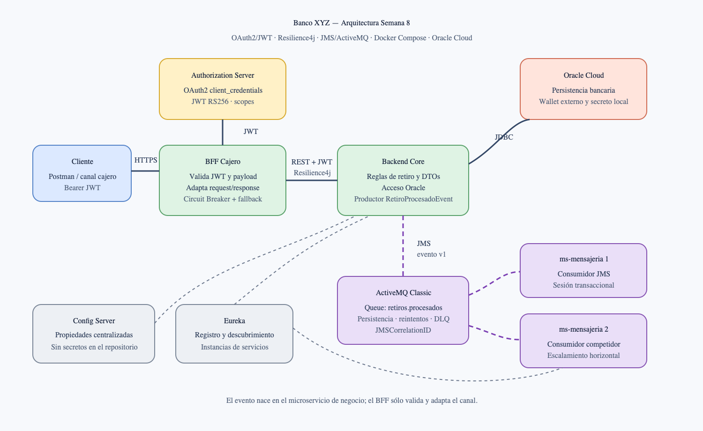

# Banco XYZ — Microservicios y resiliencia en la nube

## Evaluación sumativa Semana 8

Solución de microservicios con OAuth2/JWT, Docker Compose, Resilience4j, mensajería JMS con ActiveMQ Classic, configuración centralizada, descubrimiento de servicios y persistencia Oracle.

La implementación incorpora las correcciones solicitadas después de Semana 7: el evento de dominio nace en el microservicio de negocio, existen contratos JSON Schema versionados, los consumidores aplican reintentos y DLQ, los payloads usan Bean Validation, los DTOs de entrada y salida están separados y la operación distribuida está documentada como SAGA.

## Objetivo

Procesar un retiro desde el canal cajero manteniendo seguridad, desacoplamiento y continuidad operacional:

1. El cliente obtiene un JWT con `client_credentials`.
2. `bffcajero` valida el token, el scope y el payload.
3. El BFF llama a `backend-core` propagando el JWT y protegiendo la dependencia con Circuit Breaker.
4. `backend-core` aplica las reglas de negocio, consulta Oracle y publica `RetiroProcesadoEvent`.
5. ActiveMQ conserva el evento en `retiros.procesados`.
6. Una instancia de `ms-mensajeria` consume el evento; los fallos se reintentan y finalmente se aíslan en `ActiveMQ.DLQ`.

## Arquitectura



El archivo editable del diagrama se encuentra en [`docs/arquitectura-semana8.svg`](docs/arquitectura-semana8.svg).

### Responsabilidades

| Componente | Puerto | Responsabilidad |
|---|---:|---|
| `auth-server` | 9000 | Emite JWT RS256 con scopes OAuth2 |
| `config-server` | 8888 | Centraliza propiedades no sensibles |
| `discovery-server` | 8761 | Registro y descubrimiento Eureka |
| `backend-core` | 8081 | Reglas bancarias, Oracle y publicación JMS |
| `bffweb` | 8082 | Adapta respuestas para el canal web |
| `bffmobile` | 8083 | Adapta respuestas para el canal móvil |
| `bffcajero` | 8084 | Valida y adapta el canal cajero; aplica Resilience4j |
| `ms-mensajeria` | 8085 | Consume eventos y prepara notificaciones |
| ActiveMQ Classic | 61616 | Broker JMS y almacenamiento de mensajes |
| ActiveMQ Console | 8161 | Administración del broker |
| Oracle Cloud | externo | Persistencia bancaria |

Los BFF no aplican reglas de saldo ni publican eventos de dominio. Esa responsabilidad pertenece a `backend-core`. Las decisiones se justifican en [`docs/arquitectura-y-decisiones.md`](docs/arquitectura-y-decisiones.md).

## Estructura del código

```text
.
├── auth-server/                 Authorization Server OAuth2
├── backend-core/                Microservicio bancario y productor JMS
├── bffcajero/                   BFF del canal cajero
├── bffmobile/                   BFF del canal móvil
├── bffweb/                      BFF del canal web
├── config-server/               Configuración centralizada
├── discovery-server/            Eureka Server
├── ms-mensajeria/               Consumidor JMS
├── contracts/retiro-procesado/  JSON Schema y ejemplos versionados
├── docs/                        ADR, SAGA y plan de pruebas
├── Evidencias/                  Capturas y resultados reales de Semana 8
├── scripts/preparar-wallet.sh   Preparación local del wallet Oracle
├── Dockerfile                   Construcción multi-stage por servicio
└── docker-compose.yaml          Orquestación completa
```

## Seguridad OAuth2

`auth-server` usa Spring Authorization Server y el grant `client_credentials`. Los BFF y `backend-core` actúan como Resource Servers y validan firma, expiración, emisor y scopes:

- `cuentas.read`: consultar cuentas;
- `retiros.write`: solicitar retiros.

Una solicitud sin Bearer token recibe `401`; un token sin el scope requerido recibe `403`. El Bearer token se propaga del BFF al microservicio de negocio.

## Resilience4j

La llamada BFF → `backend-core` utiliza el Circuit Breaker `backendCore`:

```properties
sliding-window-type=COUNT_BASED
sliding-window-size=5
minimum-number-of-calls=3
failure-rate-threshold=50
wait-duration-in-open-state=10s
```

Cuando el core está inaccesible, las primeras fallas se registran y el circuito termina abierto. El cliente recibe un `503` controlado y no una excepción interna.

## Evento y mensajería JMS

El contrato vigente es `RetiroProcesadoEvent` `1.0.0` y se encuentra en [`contracts/retiro-procesado/v1/schema.json`](contracts/retiro-procesado/v1/schema.json).

```json
{
  "eventId": "6f9629dd-b391-4bfd-93d4-0090e3d6382c",
  "eventType": "RetiroProcesado",
  "eventVersion": "1.0.0",
  "occurredAt": "2026-10-04T22:00:00Z",
  "correlationId": "semana8-demo-001",
  "cuentaId": 101,
  "montoSolicitado": 1000,
  "saldoDisponible": 20000,
  "saldoRestante": 19000,
  "aprobado": true,
  "mensaje": "Retiro aprobado"
}
```

El consumidor usa una sesión JMS transaccional. Una excepción produce rollback, reentrega exponencial y envío a `ActiveMQ.DLQ` después de tres reintentos. Los logs incluyen `eventId`, `eventVersion`, `correlationId` y `deliveryCount`.

La compatibilidad hacia atrás y la política SemVer están documentadas en [`contracts/retiro-procesado/README.md`](contracts/retiro-procesado/README.md).

## Validación y DTOs

Los requests y responses son DTOs independientes. El retiro se valida en el BFF y en `backend-core` mediante `@Valid` y Bean Validation:

- monto obligatorio y positivo;
- múltiplo de `$1.000`;
- máximo de `$200.000`;
- identificador de cuenta positivo.

Un payload inválido se rechaza con `400` antes de consultar Oracle o publicar un evento.

## SAGA

La operación se representa mediante una SAGA coreografiada. Los fallos, reintentos, compensaciones y la evolución hacia Transactional Outbox se describen en [`docs/saga-retiro.md`](docs/saga-retiro.md).

## Ejecución con Docker Compose

### 1. Variables locales

```bash
cp .env.example .env
```

Reemplace los valores de `ORACLE_PASSWORD` y `OAUTH2_CLIENT_SECRET`. `.env` está excluido del repositorio.

### 2. Wallet Oracle

```bash
./scripts/preparar-wallet.sh
```

El script toma el wallet de Semana 2 por defecto o acepta otra ruta como argumento. Lo descomprime en `.local/oracle-wallet`, directorio excluido de la entrega y montado sólo en `backend-core`.

### 3. Construir e iniciar

```bash
docker compose up --build -d --wait
docker compose ps
```

### 4. Obtener un JWT

```bash
set -a
. ./.env
set +a

TOKEN=$(curl -fsS -u "$OAUTH2_CLIENT_ID:$OAUTH2_CLIENT_SECRET" \
  -X POST http://localhost:9000/oauth2/token \
  -H 'Content-Type: application/x-www-form-urlencoded' \
  --data 'grant_type=client_credentials&scope=cuentas.read retiros.write' \
  | jq -r '.access_token')
```

La captura de esta entrega conserva visibles el JWT y la credencial demostrativa para registrar la ejecución real solicitada. No reutilice esas credenciales en ambientes productivos.

### 5. Consultar y retirar

```bash
curl -i http://localhost:8084/api/cajero/cuentas/101 \
  -H "Authorization: Bearer $TOKEN"

curl -i -X POST http://localhost:8084/api/cajero/cuentas/101/retiro \
  -H "Authorization: Bearer $TOKEN" \
  -H 'Content-Type: application/json' \
  -H 'X-Correlation-Id: semana8-demo-001' \
  -d '{"monto":1000}'
```

### 6. Detener

```bash
docker compose down
```

## Variables de entorno

```text
ORACLE_DB_USERNAME
ORACLE_PASSWORD
ORACLE_JDBC_URL
OAUTH2_CLIENT_ID
OAUTH2_CLIENT_SECRET
OAUTH2_ISSUER_URI
OAUTH2_JWK_SET_URI
ACTIVEMQ_BROKER_URL
ACTIVEMQ_USER
ACTIVEMQ_PASSWORD
EUREKA_SERVER_URL
CONFIG_SERVER_URL
```

El proyecto y el ZIP no incluyen `.env`, wallet Oracle ni credenciales del entorno. Los BFF conservan únicamente keystores PKCS12 autofirmados de demostración para su ejecución HTTPS local; no deben reutilizarse en producción. Como excepción documental, la captura OAuth2 conserva la credencial y el JWT demostrativos visibles durante la ejecución real del ambiente académico.

## Pruebas y evidencias

La guía reproducible está en [`docs/pruebas-semana8.md`](docs/pruebas-semana8.md). Los resultados vigentes son:

| Evidencia | Contenido |
|---|---|
| `00_arquitectura_semana8.png` | Arquitectura corregida y responsabilidades |
| `01_docker_compose_imagenes.png` | Captura real de los servicios Compose, imágenes y contenedores saludables |
| `02_oauth2_jwt_scopes.png` | Captura real del token JWT y respuestas `401`, `403` y `400` |
| `03_resilience4j_circuit_breaker.png` | Captura real de fallos, apertura del circuito, fallback y logs correlacionados |
| `04_jms_escalabilidad_dlq.png` | Captura real de dos consumidores, distribución, reintentos y DLQ |
| `05_eureka_servicios.png` | Consola real de Eureka con el BFF y dos instancias de mensajería |
| `06_activemq_colas.png` | Consola real de ActiveMQ con consumidores, mensajes procesados y DLQ |
| `07_oracle_backend_end_to_end.png` | Ejecución real con Oracle: health, consulta, retiro `200` y publicación JMS |
| `08_compose_oracle_flujo_completo.png` | Ejecución real de los nueve contenedores: OAuth2, BFF, Oracle, publicación y consumo JMS con la misma correlación |

Las capturas corresponden a ejecuciones reales. La evidencia OAuth2 conserva las credenciales demostrativas y el JWT visibles.

El 2026-10-05 se repitió la validación con Autonomous Database disponible. `backend-core` abrió una conexión JDBC real, reportó `health=UP`, consultó la cuenta `101`, procesó un retiro de `$1.000` con respuesta `200 OK` y publicó `RetiroProcesadoEvent` en `retiros.procesados`. La ejecución directa se conserva en `07_oracle_backend_end_to_end.png`; la prueba integral por `bffcajero`, con los nueve contenedores activos y el mismo `correlationId` en publicación y consumo, se conserva en `08_compose_oracle_flujo_completo.png`.

## Pruebas automatizadas

```bash
for module in auth-server backend-core bffweb bffmobile bffcajero ms-mensajeria config-server discovery-server; do
  (cd "$module" && mvn -B test)
done
```

Resultado registrado: 17 pruebas, 0 fallas y 0 errores. `config-server` y `discovery-server` compilan correctamente y no contienen clases de prueba.

## Tecnologías

Java 17, Spring Boot, Spring Authorization Server, Spring Security OAuth2 Resource Server, Spring Cloud Config, Netflix Eureka, Resilience4j, JMS, ActiveMQ Classic, Oracle Database, Docker Compose y Maven.
